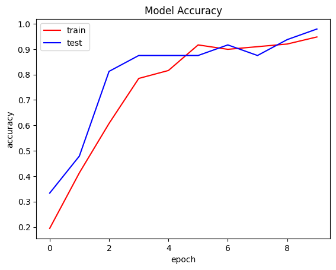

# Halodek by Bangkit 2023 C23-PR534 Product Capstone
A mobile app for baby cry recognition is a tool designed to help parents or caregivers understand and analyze the crying patterns of infants. This app aims to assist parents in better understanding and responding to their baby's needs, promoting effective communication and care.

## Machine Learning
we built a TensorFlow model to predict baby's cry based on its characteristics, whether their baby is hungry, sleepy, in need of a diaper change, scared, belly pain, burp, temperature, or lonely.

### Dataset
We collected a diverse range of baby crying sounds from various sources, including YouTube channels and GitHub repositories:
https://github.com/gveres/donateacry-corpus/tree/master/donateacry_corpus_cleaned_and_updated_data 
https://github.com/royangkr/BabyReady/tree/master/BabyReady%20-%20Python/data 

### Architecture of Model
This architecture combines convolutional neural networks (CNNs) and dense layers for the baseline model with 8 classes (hungry, sleepy, discomfort, scared, belly pain, burp, temperature, or lonely).


### Workflow of Getting a Baby Crying Prediction
1. The user records the sound of a baby crying using the app. 
2. The recorded audio resampled into 16kHZ and converted into a spectrogram, capturing the frequency and time components. 
3. The trained model takes the spectrogram as input classify the cry into distinct categories.

### Model Performance
The model has been trained on over 340 baby's cry and got 89% accuracy on test data
|   |  |

## Cloud Computing
This is the backend repository Halodek Project For CRUD using RESTFul API. See the documentation for use RESTAPI [[Docummentation]](https://docs.google.com/document/d/1eN2xFW4rpklSDkPZWBPh6-LZ688wyZRP2QFsMmWIk1A/edit?usp=sharing)
### Create Google Cloud SQL (MySQL)
1. Create instance and choose MySQL
2. Provide a name and password for your instance.
3. Configure the instance settings such as region, machine type, storage capacity, and database version.
4. Click on the "Create" button to create the MySQL instance.
5. Wait for the instance to be provisioned. The process may take a few minutes.

### Deploy to Google Cloud Platform
#### Docker Image
1. Clone this repository on your VM instance
2. Go to source directory
```cd halodek-project```
3. Build a docker image
```
# build docker image
docker build -t <image-name> .
docker tag <image-name> gcr.io/<project-id>/<image-name>

# configure docker for google cloud
gcloud auth configure-docker

# push image
docker push gcr.io/<project-id>/<image-name>
```
#### Cloud Run
1. Create service and deploy one revision from an existing container image
2. On container image URL, select container registry and choose the latest image
3. Specify a service name, region, and select the container image you pushed to the Container Registry.
4. Configure additional options such as the number of instances, CPU, memory, and maximum request concurrency.
5. Set the authentication method, if required.
6. Click on "Create" to deploy the container image to Cloud Run.

## Mobile Development 
### Featured Technologies
Kotlin : It is a contemporary, succinct, and secure programming language. With its brevity, safety, and interoperability features, Kotlin stands out in the modern development landscape.
Retrofit : Retrofit serves as the mechanism that transforms API interfaces into callable objects. It acts as the bridge that allows to seamlessly interact with APIs by encapsulating them within callable entities.
MediaRecorder : MediaRecorder is the modern Android framework API for audio recording that supersedes the outdated audio recording libraries.

### Screenshot of UI Design
|   |  |